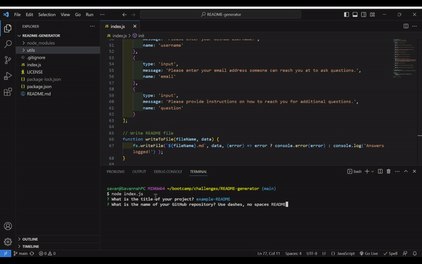
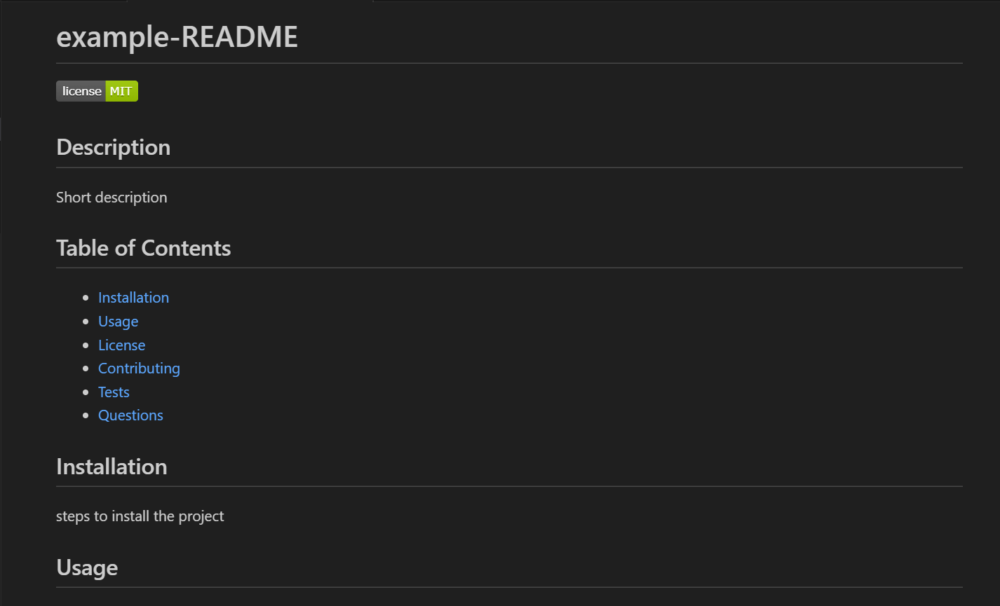

# README-Generator

## Description

This is a Node.js command-line application that asks the user a series of questions and utilizes the user's response to generate a unique professional README file for their project. 

## Table of Contents
- [Installation](#installation)
- [Usage](#usage)
- [Credits](#credits)
- [License](#license)

## Installation
To use this code, you will need to clone it to your local machine using: 

    git clone git@github.com:Savannah-Shifflet/README-generator.git

Additionally, this code uses the Inquirer package which can be installed by running the following command:
    
    npm install 

## Usage
Open the directory where you cloned the code and installed the necessary dependencies. 

Then utilize Node.js to run the application: 

    node index.js

The application will walk you through a serious of questions to generate the README. The README file will be generated in the same directory. 

A video tutorial can be found [here.](https://drive.google.com/file/d/1vCp9HqLtOyxXVMqRqDe2om6Kl1M_p5nm/view)

Below is a gif of example usage and screenshot of the sample README: 

## Credits
Utilized the Inquirer package which can be found [here.](https://www.npmjs.com/package/inquirer/v/8.2.4)

Starter code from The University of Texas at Austin. 

## License

This project is covered under the MIT License.
